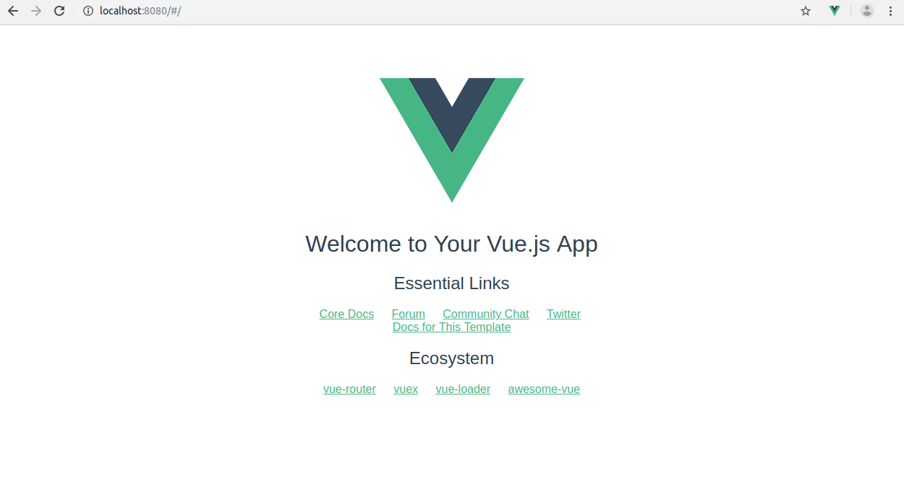
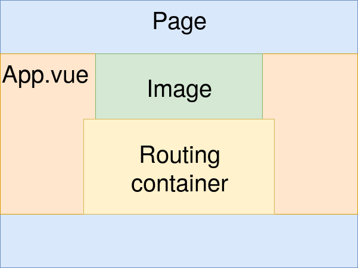
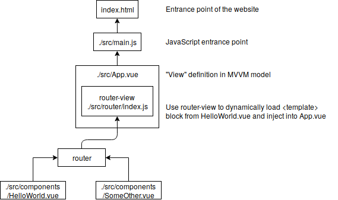
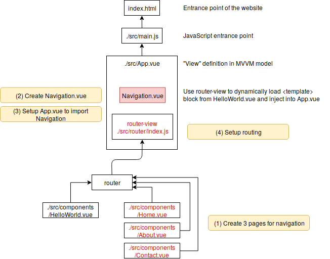
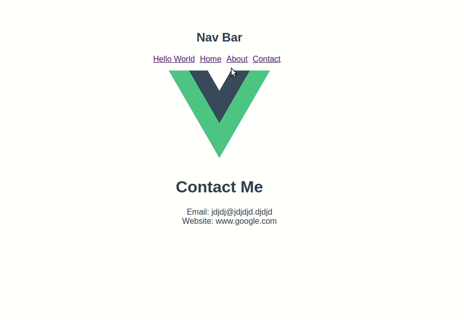

# myproject1

> A Vue.js project

## Build Setup

``` bash
# install dependencies
npm install

# serve with hot reload at localhost:8080
npm run dev

# build for production with minification
npm run build

# build for production and view the bundle analyzer report
npm run build --report
```

For a detailed explanation on how things work, check out the [guide](http://vuejs-templates.github.io/webpack/) and [docs for vue-loader](http://vuejs.github.io/vue-loader).

# Construct env

Use npm to mange tools.
```bash
npm install -g vue-cli
```

Create Vue project by vue-cli command
```bash
vue init webpack myproject1
```

```
Install vue-router? Yes
? Use ESLint to lint your code? Yes
? Pick an ESLint preset Standard
? Set up unit tests No
? Setup e2e tests with Nightwatch? No
? Should we run `npm install` for you after the project has been created? (recommended) (Use arrow keys)
❯ Yes, use NPM
```

Install neccessery node.js component
```bash
cd myproject1
npm install
```

## Run the server
```bash
npm run dev
```
Then you can access your website by access `http://localhost:8080`




(reference: [包学会之浅入浅出Vue.js：开学篇](https://cloud.tencent.com/developer/article/1020337?fromSource=waitui))

## Include structure of Vue project



# Make our own navagation bar
1. Create 3 pages for navigation
2. Create Navigation.vue
3. Setup App.vue to import navigation
4. Setup routing




## (1) Create 3 pages for navigation

**./src/components/Home.vue**
```javascript
<template>
  <div>
    <h1>Home</h1>
    <p>Here is some information. This is the home page</p>
  </div>
</template>

<script>
export default {
  name: 'Home'
}
</script>
<style>
</style>

```

**./src/components/About.vue**
```javascript
<template>
  <div>
    <h1>About</h1>
    <p>Here is some information. This is the about page</p>
  </div>
</template>

<script>
export default {
  name: 'About'
}
</script>
<style>
</style>

```

**./src/components/Contact.vue**
```javascript
<template>
  <div>
    <h1>Contact Me</h1>
  <p>
    <ul>
      <li>Email: {{email}}</li>
      <li>Website: {{web}}</li>
    </ul>
  </p>
  </div>
</template>

<script>
export default {
  name: 'Contact',
  data () {
    return {
      email: 'jdjdj@jdjdjd.djdjd',
      web: 'www.google.com'
    }
  }
}
</script>

```

(2) Create Navigation.vue

**./src/components/Navigation.vue**
```javascript
<template>
  <div>
    <h2>Nav Bar</h2>
    <nav>
      <router-link class="spacing" v-for="routes in links" 
      v-bind:key="routes.id"
      :to="`${routes.page}`">{{routes.text}}</router-link>
    </nav>
  </div>
</template>

<script>
export default {
  name: 'Navigation',
  data() {
    return {
      links: [
        {
          id: 0,
          text: 'Hello World',
          page:'/HelloWorld'
        },
        {
          id: 1,
          text: 'Home',
          page:'/Home'
        },
        {
          id: 2,
          text: 'About',
          page:'/About'
        },
        {
          id: 3,
          text: 'Contact',
          page:'/Contact'
        }
      ]
    }
  }
}
</script>
<style>
.spacing {
  margin-right: 10px;
}
</style>
```

## (3) Setup navigation

1. Insert `<Navigation></Navigation>` inside the <div id="app"> tag
2. Import Navigation component in App.vue

```javascript
<template>
  <div id="app">
    <Navigation></Navigation>
    
    <router-view/>
  </div>
</template>

<script>
import Navigation from './components/Navigation'
export default {
  name: 'App',
  components: {
    'Navigation': Navigation
  }
}
</script>

<style>
#app {
  font-family: 'Avenir', Helvetica, Arial, sans-serif;
  -webkit-font-smoothing: antialiased;
  -moz-osx-font-smoothing: grayscale;
  text-align: center;
  color: #2c3e50;
  margin-top: 60px;
}
</style>
```

  ## (4) Setup routing

```javascript
import Vue from 'vue'
import Router from 'vue-router'
import HelloWorld from '@/components/HelloWorld'

import Home from '@/components/Home' // this is the import line to add
import About from '@/components/About'
import Contact from '@/components/Contact'

Vue.use(Router)

export default new Router({
  routes: [
    {
      path: '/',
      name: 'HelloWorld',
      component: HelloWorld
    },
    {
      path: '/home',
      name: 'Home',
      component: Home
    },
    {
      path: '/about',
      name: 'About',
      component: About
    },
    {
      path: '/contact',
      name: 'Contact',
      component: Contact
    }
  ]
})

```
  
gif created by Peek under Ubuntu

# Reference
1. How to create a navigation bar in Vue.js ([article](https://medium.com/@maeganwilson_/how-to-create-a-navigation-bar-in-vue-js-8a70e7f29f80)) ([code](https://github.com/maeganjwilson/vue-nav))