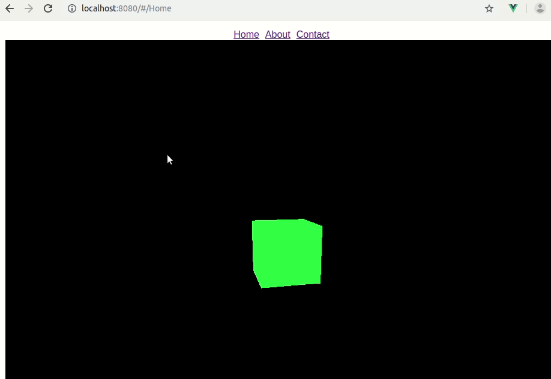

# Demo - Navigation bar

  
gif created by Peek under Ubuntu

# myproject1

> A Vue.js project

## Build Setup

``` bash
# install dependencies
npm install

# serve with hot reload at localhost:8080
npm run dev

# build for production with minification
npm run build

# build for production and view the bundle analyzer report
npm run build --report
```

For a detailed explanation on how things work, check out the [guide](http://vuejs-templates.github.io/webpack/) and [docs for vue-loader](http://vuejs.github.io/vue-loader).

# Steps

1. Install three.js

```bash
npm install three --save
```

2. Change the content of `Home.vue`


# Reference 

1. StackOverflow - [Import and use three.js library in vue component](https://stackoverflow.com/questions/47849626/import-and-use-three-js-library-in-vue-component)
2. [three.js - Creating a scene](https://threejs.org/docs/index.html#manual/en/introduction/Creating-a-scene)