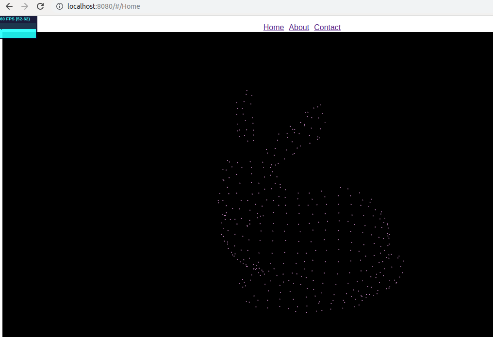

# Demo - three.js

  
gif created by Peek under Ubuntu

# myproject3

> A Vue.js project

## Build Setup

``` bash
# install dependencies
npm install

# serve with hot reload at localhost:8080
npm run dev

# build for production with minification
npm run build

# build for production and view the bundle analyzer report
npm run build --report
```

For a detailed explanation on how things work, check out the [guide](http://vuejs-templates.github.io/webpack/) and [docs for vue-loader](http://vuejs.github.io/vue-loader).

### Run express server

```bash
node app.js
```

# Steps

Modify the sample code in [1] to Vue.js syntax.


# Reference 

1. GitHub - three.js - [webgl_loader_pcd.html](https://github.com/mrdoob/three.js/blob/dev/examples/webgl_loader_pcd.html)